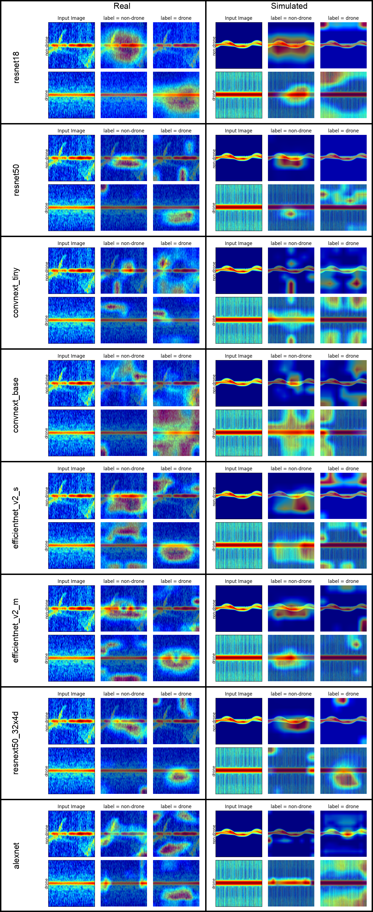
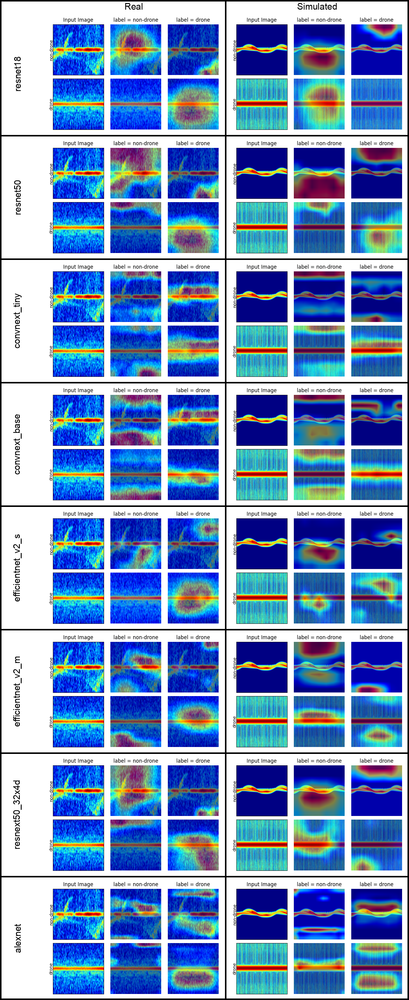
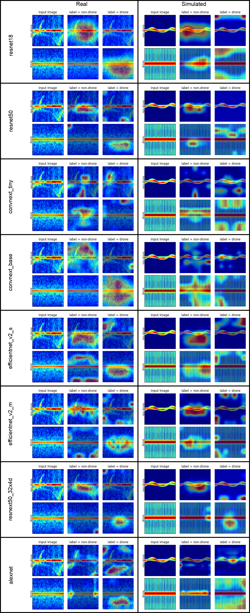
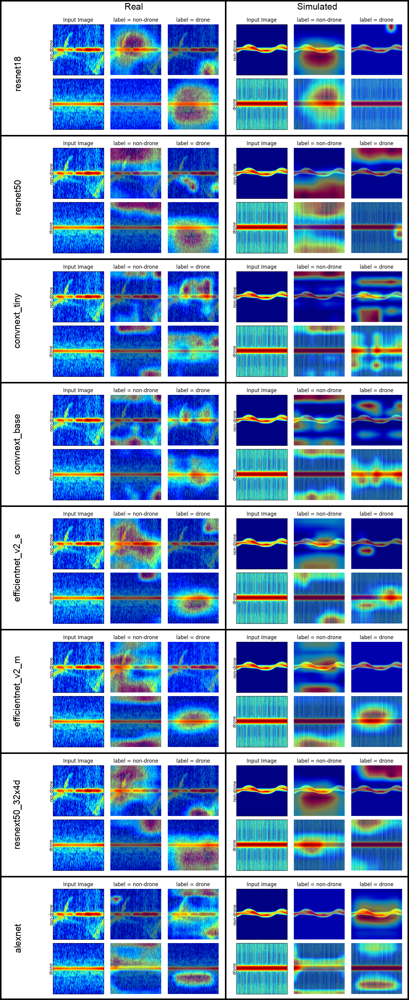
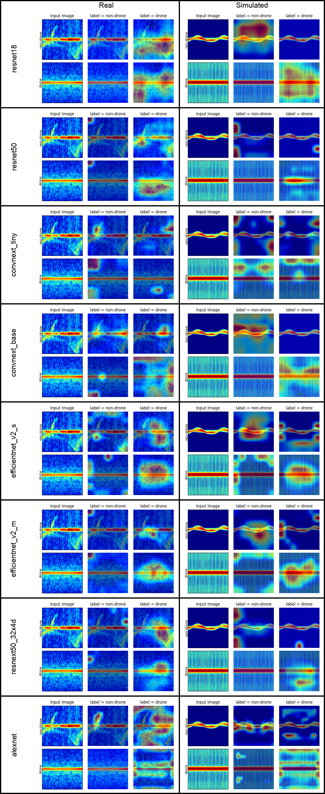
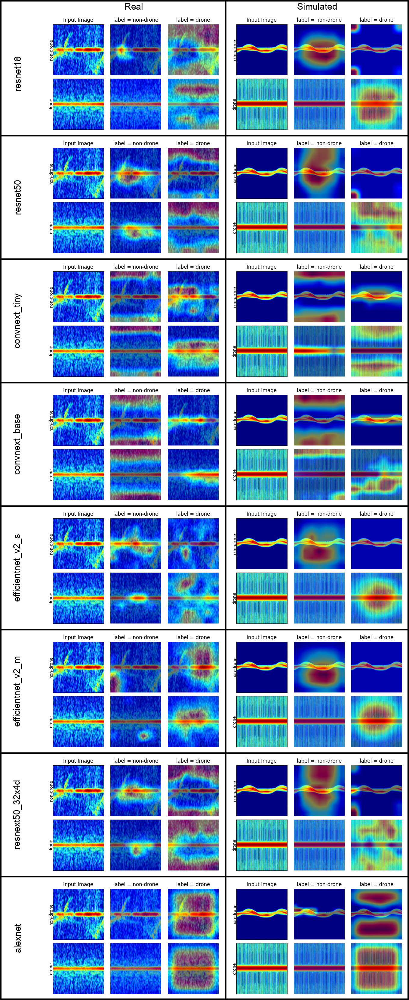

# MathWorks Radar Drone Classification Project
This project is for MathWorks-St Andrews Radar Drone Classification Project, implemented by [Zhongliang Guo](mailto:zg34@st-andrews.ac.uk).

This project supports a series of advanced neural networks, including:
```python
IMPLEMENTED_NETS = (
    'resnet18',
    'resnet50',
    'convnext_tiny',
    'convnext_base',
    'efficientnet_v2_s',
    'efficientnet_v2_m',
    'resnext50_32x4d',
    'alexnet',
)
```

It can achieve different tasks:
1. binary classification for `drone` and `non-drone`.
2. different drone type classification, including `Autel_Evo_II`, `DJI_Matrice_210`, `DJI_Mavic_3`, `DJI_Mini_2`, and `Yuneec_H520E`.
3. quadruple classification, including `drone`, `bird`, `clutter`, and `noise`.

## Usage
You can run the python script in MATLAB by the [instruction](https://ch.mathworks.com/products/matlab/matlab-and-python.html).

### Train

a simple usage for training a neural networks.
```bash
python train.py \
  --task binary \
  --arch resnet18 \
  --epochs 100 \
  --ckpt_interval 20 \
  --batch_size 64 \
  --lr 1e-05 \
  --random_seed 3407 \
  --data_root /.../data \
  --train_label_path /.../train_binary.csv \
  --eval_label_path /.../eval_binary.csv \
  --output_dir ./logs
```
For more details, please run
```bash
python train.py --help
```

#### How to see the real-time training curve

1. change the directory to the `output_dir`

2. run the following bash
   ```bash
   tensorboard --logdir=./
   ```

   please make sure you've already installed the library `tensorboard`, if not , just run `pip install tensorboard`.

### Inference

```bash
python inference.py \
  --task binary \
  --arch resnet18 \
  --image_path /.../XXX.png \
  --pth_path /.../XXX.pth
```
## Dataset

Download the dataset by clicking [here](https://universityofstandrews907-my.sharepoint.com/:u:/g/personal/zg34_st-andrews_ac_uk/ESk5d0jrmJxGlAtqbLXO8qEBgh2hf76TyW7dhaOfu81kFw?e=iVo9Ex). The password is `mathworks2024`.

## Results

trained on the machine with

- OS: `Ubuntu 20.04.6 LTS`
- GPU: `NVIDIA A100-SXM4-80GB`
- CPU: `AMD EPYC 7713 64-Core Processor`

### Accuracy with pt (20 epochs)

#### Real dataset

| task                 | AlexNet | ConvNeXt-base | ConvNeXt-tiny | EfficientNetV2-m | EfficientNetV2-s | ResNet18 | ResNet50 | ResNeXt50 |
| -------------------- | ------- | ------------- | ------------- | ---------------- | ---------------- | -------- | -------- | --------- |
| binary               | 100%    | 100%          | 100%          | 100%             | 100%             | 100%     | 100%     | 100%      |
| drone-classification | 97.60%  | 99.02%        | 98.91%        | 96.73%           | 98.04%           | 96.29%   | 94.66%   | 96.84%    |
| four-class           | 94.29%  | 92.09%        | 91.43%        | 99.34%           | 97.36%           | 94.73%   | 93.63%   | 91.43%    |

#### Simulated dataset

bird

|            | AlexNet | ConvNeXt-base | ConvNeXt-tiny | EfficientNetV2-m | EfficientNetV2-s | ResNet18 | ResNet50 | ResNeXt50 |
| ---------- | ------- | ------------- | ------------- | ---------------- | ---------------- | -------- | -------- | --------- |
| binary     | 100%    | 100%          | 95%           | 99%              | 94%              | 97%      | 73%      | 94%       |
| four-class | 81%     | 77%           | 48%           | 59%              | 50%              | 58%      | 22%      | 65%       |

drone

|            | AlexNet | ConvNeXt-base | ConvNeXt-tiny | EfficientNetV2-m | EfficientNetV2-s | ResNet18 | ResNet50 | ResNeXt50 |
| ---------- | ------- | ------------- | ------------- | ---------------- | ---------------- | -------- | -------- | --------- |
| binary     | 81%     | 47%           | 73%           | 38%              | 5%               | 88%      | 59%      | 75%       |
| four-class | 73%     | 92%           | 77%           | 78%              | 84%              | 45%      | 84%      | 91%       |

### Accuracy without pt (20 epochs)

#### Real dataset

| task                 | AlexNet | ConvNeXt-base | ConvNeXt-tiny | EfficientNetV2-m | EfficientNetV2-s | ResNet18 | ResNet50 | ResNeXt50 |
| -------------------- | ------- | ------------- | ------------- | ---------------- | ---------------- | -------- | -------- | --------- |
| binary               | 99.95%  | 97.72%        | 98.14%        | 98.51%           | 99.63%           | 100%     | 99.86%   | 99.91%    |
| drone-classification | 91.28%  | 67.50%        | 69.36%        | 33.48%           | 47.98%           | 94.77%   | 80.04%   | 77.86%    |
| four-class           | 88.79%  | 83.30%        | 79.56%        | 69.23%           | 79.12%           | 87.25%   | 77.80%   | 82.42%    |

#### Simulated dataset

bird

| Task       | AlexNet | ConvNeXt-base | ConvNeXt-tiny | EfficientNetV2-m | EfficientNetV2-s | ResNet18 | ResNet50 | ResNeXt50_32x4d |
| ---------- | ------- | ------------- | ------------- | ---------------- | ---------------- | -------- | -------- | --------------- |
| Binary     | 99%     | 93%           | 97%           | 99%              | 94%              | 100%     | 100%     | 100%            |
| Four-class | 29%     | 63%           | 68%           | 62%              | 100%             | 93%      | 100%     | 100%            |

drone

| Task       | AlexNet | ConvNeXt-base | ConvNeXt-tiny | EfficientNetV2-m | EfficientNetV2-s | ResNet18 | ResNet50 | ResNeXt50_32x4d |
| ---------- | ------- | ------------- | ------------- | ---------------- | ---------------- | -------- | -------- | --------------- |
| Binary     | 50%     | 67%           | 69%           | 52%              | 34%              | 18%      | 45%      | 32%             |
| Four-class | 21%     | 30%           | 25%           | 39%              | 21%              | 20%      | 21%      | 21%             |

### Accuracy with pt (100 epochs)

#### Real dataset

| task                 | AlexNet | ConvNeXt-base | ConvNeXt-tiny | EfficientNetV2-m | EfficientNetV2-s | ResNet18 | ResNet50 | ResNeXt50 |
| -------------------- | ------- | ------------- | ------------- | ---------------- | ---------------- | -------- | -------- | --------- |
| binary               | 100%    | 100%          | 100%          | 100%             | 100%             | 100%     | 100%     | 100%      |
| drone-classification | 98.26%  | 99.89%        | 99.56%        | 99.35%           | 99.35%           | 96.84%   | 96.84%   | 98.69%    |
| four-class           | 94.29%  | 95.16%        | 98.02%        | 99.34%           | 98.68%           | 94.73%   | 99.34%   | 93.63%    |

#### Simulated dataset

bird

| Task       | AlexNet | ConvNeXt-base | ConvNeXt-tiny | EfficientNetV2-m | EfficientNetV2-s | ResNet18 | ResNet50 | ResNeXt50_32x4d |
| ---------- | ------- | ------------- | ------------- | ---------------- | ---------------- | -------- | -------- | --------------- |
| binary     | 100%    | 100%          | 98%           | 99%              | 100%             | 97%      | 78%      | 100%            |
| four-class | 81%     | 78%           | 28%           | 55%              | 43%              | 58%      | 29%      | 48%             |

drone

| Task       | AlexNet | ConvNeXt-base | ConvNeXt-tiny | EfficientNetV2-m | EfficientNetV2-s | ResNet18 | ResNet50 | ResNeXt50_32x4d |
| ---------- | ------- | ------------- | ------------- | ---------------- | ---------------- | -------- | -------- | --------------- |
| binary     | 86%     | 51%           | 68%           | 46%              | 3%               | 83%      | 50%      | 62%             |
| four-class | 73%     | 84%           | 79%           | 62%              | 78%              | 45%      | 85%      | 91%             |

### Accuracy without pt (100 epochs)

#### Real dataset

| task                 | AlexNet | ConvNeXt-base | ConvNeXt-tiny | EfficientNetV2-m | EfficientNetV2-s | ResNet18 | ResNet50 | ResNeXt50 |
| -------------------- | ------- | ------------- | ------------- | ---------------- | ---------------- | -------- | -------- | --------- |
| binary               | 100%    | 99.86%        | 99.77%        | 100%             | 100%             | 100%     | 100%     | 100%      |
| drone-classification | 98.8%   | 93.46%        | 94.44%        | 95.20%           | 92.80%           | 97.60%   | 90.73%   | 88.11%    |
| four-class           | 98.02%  | 87.03%        | 86.59%        | 84.62%           | 85.05%           | 91.21%   | 83.96%   | 86.37%    |

#### Simulated dataset

bird

|            | AlexNet | ConvNeXt-base | ConvNeXt-tiny | EfficientNetV2-m | EfficientNetV2-s | ResNet18 | ResNet50 | ResNeXt50 |
| ---------- | ------- | ------------- | ------------- | ---------------- | ---------------- | -------- | -------- | --------- |
| binary     | 93%     | 98%           | 100%          | 100%             | 98%              | 100%     | 100%     | 100%      |
| four-class | 58%     | 78%           | 68%           | 94%              | 99%              | 91%      | 100%     | 100%      |

drone

|            | AlexNet | ConvNeXt-base | ConvNeXt-tiny | EfficientNetV2-m | EfficientNetV2-s | ResNet18 | ResNet50 | ResNeXt50 |
| ---------- | ------- | ------------- | ------------- | ---------------- | ---------------- | -------- | -------- | --------- |
| binary     | 68%     | 70%           | 92%           | 65%              | 87%              | 22%      | 21%      | 52%       |
| four-class | 23%     | 24%           | 17%           | 42%              | 51%              | 36%      | 16%      | 18%       |

### Train with simulated data

#### without pt 100

on simulated data

| class | AlexNet | ConvNeXt-base | ConvNeXt-tiny | EfficientNetV2-m | EfficientNetV2-s | ResNet18 | ResNet50 | ResNeXt50_32x4d |
| ----- | ------- | ------------- | ------------- | ---------------- | ---------------- | -------- | -------- | --------------- |
| bird  | 100%    | 100%          | 100%          | 100%             | 100%             | 100%     | 100%     | 100%            |
| drone | 100%    | 100%          | 100%          | 100%             | 100%             | 100%     | 100%     | 100%            |

transferability on real data

| class | AlexNet | ConvNeXt-base | ConvNeXt-tiny | EfficientNetV2-m | EfficientNetV2-s | ResNet18 | ResNet50 | ResNeXt50_32x4d |
| ----- | ------- | ------------- | ------------- | ---------------- | ---------------- | -------- | -------- | --------------- |
| bird  | 6%      | 67%           | 66%           | 19%              | 51%              | 2%       | 35%      | 33%             |
| drone | 98%     | 38%           | 41%           | 95%              | 88%              | 100%     | 63%      | 80%             |

#### with pt 100

on simulated data

| class | AlexNet | ConvNeXt-base | ConvNeXt-tiny | EfficientNetV2-m | EfficientNetV2-s | ResNet18 | ResNet50 | ResNeXt50_32x4d |
| ----- | ------- | ------------- | ------------- | ---------------- | ---------------- | -------- | -------- | --------------- |
| bird  | 100%    | 100%          | 100%          | 100%             | 100%             | 100%     | 100%     | 100%            |
| drone | 100%    | 100%          | 100%          | 100%             | 100%             | 100%     | 100%     | 100%            |

transferability on real data

| Model | AlexNet | ConvNeXt-base | ConvNeXt-tiny | EfficientNetV2-m | EfficientNetV2-s | ResNet18 | ResNet50 | ResNeXt50_32x4d |
| ----- | ------- | ------------- | ------------- | ---------------- | ---------------- | -------- | -------- | --------------- |
| bird  | 33%     | 15%           | 0%            | 13%              | 2%               | 0%       | 0%       | 0%              |
| drone | 100%    | 99%           | 100%          | 93%              | 100%             | 100%     | 100%     | 100%            |

### Runtime (in second)

OS: `Ubuntu 22.04.4 LTS`

#### GPU

tested on `NVIDIA RTX3060 12G`

| task                 | AlexNet | ConvNeXt-base | ConvNeXt-tiny | EfficientNetV2-m | EfficientNetV2-s | ResNet18 | ResNet50 | ResNeXt50 |
| -------------------- | ------- | ------------- | ------------- | ---------------- | ---------------- | -------- | -------- | --------- |
| binary               | 0.0059  | 0.0128        | 0.0094        | 0.0279           | 0.0217           | 0.0078   | 0.0102   | 0.0114    |
| drone-classification | 0.0062  | 0.0144        | 0.0103        | 0.0289           | 0.0218           | 0.0077   | 0.0109   | 0.0109    |
| four-class           | 0.0056  | 0.0136        | 0.0094        | 0.0288           | 0.0223           | 0.0081   | 0.0110   | 0.0107    |

#### CPU

tested on `Intel i5-11400`

| task                 | AlexNet | ConvNeXt-base | ConvNeXt-tiny | EfficientNetV2-m | EfficientNetV2-s | ResNet18 | ResNet50 | ResNeXt50 |
| -------------------- | ------- | ------------- | ------------- | ---------------- | ---------------- | -------- | -------- | --------- |
| binary               | 0.0154  | 0.1149        | 0.0451        | 0.0874           | 0.0537           | 0.0207   | 0.0440   | 0.0519    |
| drone-classification | 0.0164  | 0.1227        | 0.0443        | 0.0889           | 0.0525           | 0.0220   | 0.0459   | 0.0490    |
| four-class           | 0.0155  | 0.1139        | 0.0441        | 0.0864           | 0.0530           | 0.0204   | 0.0441   | 0.0486    |

### Grad-CAM Visualization

#### binary

##### with pt 20 epochs


##### without pt 20 epochs


##### with pt 100 epochs


##### without pt 100 epochs


#### drone-classification

##### with pt 20 epochs


##### without pt 20 epochs


##### with pt 100 epochs


##### without pt 100 epochs


#### four-class

##### with pt 20 epochs


##### without pt 20 epochs


##### with pt 100 epochs


##### without pt 100 epochs


#### Simulation Data

##### with pt 20 epochs
binary


four class


##### without pt 20 epochs
binary


four class


##### with pt 100 epochs

binary



four class


##### without pt 100 epochs

binary


four class


#### Models trained on simulated data

##### with pt 100



##### without pt 100



## Environment

This project requires the Python3 environment with the following libraries:
```text
pandas==1.5.2
Pillow==9.2.0
tensorboardX==2.6.2.2
torch==2.0.0
torchvision==0.15.1
tqdm==4.65.0
```
The docker image that contains the environment I used for this project is available [here](https://hub.docker.com/r/zhongliangguo/custom_torch_image).

## Reference

1. Krizhevsky A, Sutskever I, Hinton G E. Imagenet classification with deep convolutional neural networks[J]. Advances in neural information processing systems, 2012, 25.
2. He K, Zhang X, Ren S, et al. Deep residual learning for image recognition[C]//Proceedings of the IEEE conference on computer vision and pattern recognition. 2016: 770-778.
3. Xie S, Girshick R, Dollár P, et al. Aggregated residual transformations for deep neural networks[C]//Proceedings of the IEEE conference on computer vision and pattern recognition. 2017: 1492-1500.
4. Tan M, Le Q. Efficientnet: Rethinking model scaling for convolutional neural networks[C]//International conference on machine learning. PMLR, 2019: 6105-6114.
5. Liu Z, Mao H, Wu C Y, et al. A convnet for the 2020s[C]//Proceedings of the IEEE/CVF conference on computer vision and pattern recognition. 2022: 11976-11986.

